# School District Analysis
Analyze the students' standardized test score

## Overview of the Project
The school board has notified Maria and her supervisor that the students_complete.csv file shows evidence of academic dishonesty; specifically, reading and math grades for Thomas High School ninth graders appear to have been altered. The school board requested to do following to uphold state-testing standards:

1. Replace the math and reading scores for Thomas High School with NaNs while keeping the rest of the data intact.
2. Repeat the school district analysis.
3. Write up a report to describe how these changes affected the overall analysis.

So that we can analyze if this event have impacted the overall performance of each school in passing the exams as the school performance is the key measurement to decide school budgetting.

Through the analysis, I focused on measuring the change in below variables:
**"% Passing Math," "% Passing Reading," "% Overall Passing," and School Performance Ranking** to determine how much the event impacted the analysis.

## Resources
- Data Source: schools_complete.csv, students_complete.csv
- Software: Python 3.6.1, Jupytor Note Book

## Results
+ How is the district summary affected?
  
  Comparing the two screen shots from district summary before and after replacing the Thomas High School 9th grade students' scorres with NaN, we can observe about 0.1%-0.3% drop in "% Passing Math," "% Passing Reading," and "% Overall Passing" after the event. 
 
  **Before the replacement**
  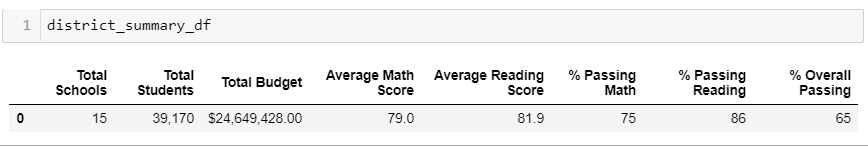
  
  **After the replacement**
  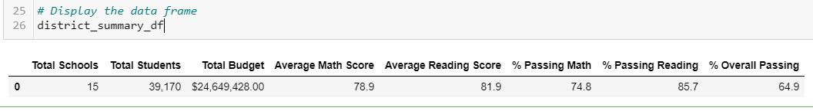
  
  Therefore, the replacement of scores to NaN did slightly negatively impact on the District Summary overall Passing percentage.
  
+ How is the school summary affected?
  
  Reviewing the below tables, we can find that "% Passing Math," "% Passing Reading," and "% Overall Passing" for Thomas High School are declined by approximately 0.3% after replacing the 9th Grade students' scores by NaN.
  
  **Before the replacement**
  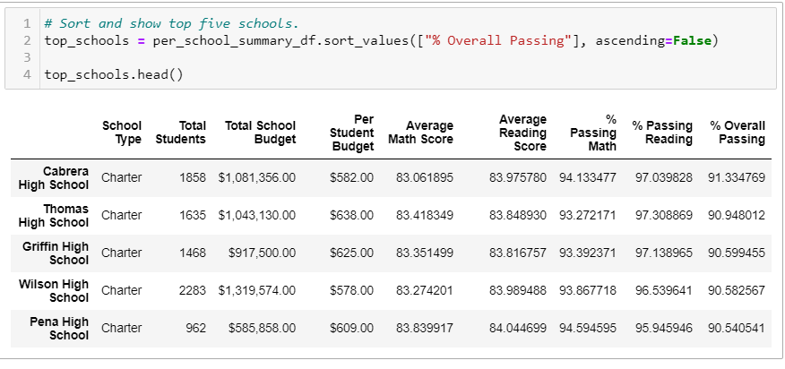
  
  **After the replacement**
  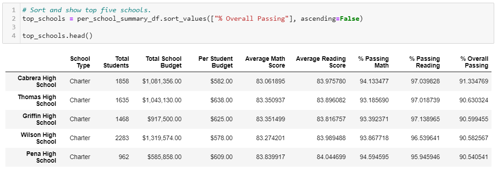

+ How does replacing the ninth graders’ math and reading scores affect Thomas High School’s performance relative to the other schools?
  

  
  Althouth the event affected the metrics in the previous two cases, the impact was not large enough to affect the ranking of Thomas High School relative to other schools as shown in the below two rankings.
  
  **Before the replacement**
  
  
  **After the replacement**
  
  
+ How does replacing the ninth-grade scores affect the following:
  Note that I did not observe any affect from the replacement comparing the before and the after as below images for all four categories of analysis.
  
   + Math and reading scores by grade

   **Before the replacement**
   
   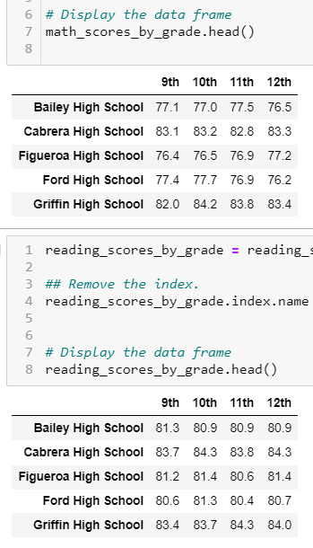
  
   **After the replacement**
   
   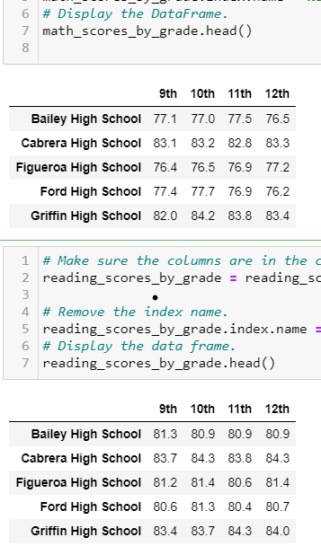
   
   + Scores by school spending

   **Before the replacement**
   
   
  
   **After the replacement**
   
   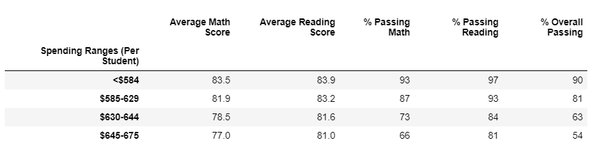
   
   + Scores by school size
   
   **Before the replacement**
   
   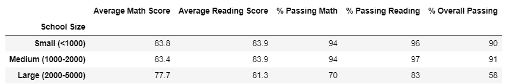
  
   **After the replacement**
   
   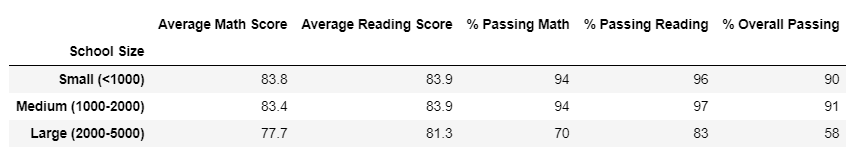
   
   + Scores by school type

   **Before the replacement**
   
   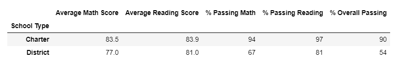
  
   **After the replacement**
   
   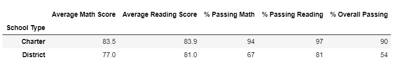

## Summary
   Summarize four major changes in the updated school district analysis after reading and math scores for the ninth grade at Thomas High School have been replaced with NaNs.

   In conclusion, the impact of replacing the reading and math scores with NaNs for the ninth grade at Thomas High School on the  school district analysis was minimul. Comparing each analysis result from before and the after change, we could find **0.1-0.3% decline** on "% Passing Math," "% Passing Reading," and "% Overall Passing" from the District Summary. Also, the "% Passing Math," "% Passing Reading," and "% Overall Passing" for Thomas High School are declined by approximately 0.3% after replacing the 9th Grade students' scores by NaN.
   However, all other measurements such as the ranking of Top and Bottom performing schools, Math and reading scores by grade, Scores by school spending, Scores by school size, and Scores by school type all did not show big differences. Therefore, the school board can make decesion on school budget without considering the impact from this event.
   
